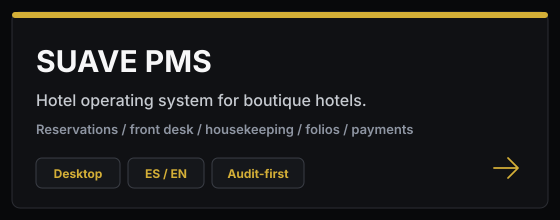
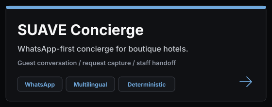
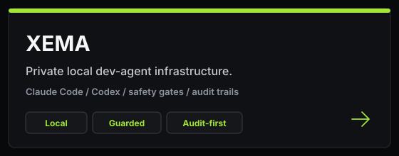

# Bruno Di Santo

**Founder and engineer building SUAVE, and the private local agent infrastructure
around it.**

Mexico City and Oaxaca. Building operational software for boutique hotels and a
guarded personal development agent that helps me move faster without lowering the
engineering bar.

[LinkedIn](https://www.linkedin.com/in/disantobruno/)

  
  &nbsp;&nbsp;
  
    
  

---

## Building

| Product | What it is |
| --- | --- |
| **[SUAVE PMS](./pms/)** | A hotel operating system for reservations, rooms, payments, folios, team workflows, and full auditability. |
| **[SUAVE Concierge](./concierge/)** | A WhatsApp-first concierge for boutique hotels — guests text the property, the bot understands and replies, staff take over when needed. |
| **[XEMA](./xema/)** | A private local development agent project: safety-first orchestration around Claude Code, Codex, repo boundaries, audit trails, and human gates. |

Most production code is private. I don't publish customer data, credentials,
provider configuration, or internal architecture just to make a profile look
busier.

---

## Engineering Focus

- **Frontend product:** React, TypeScript, dense operational UIs, dashboards for staff who work the system all day.
- **Backend and data:** Postgres with row-level security, RPC boundaries, durable audit logs, typed service layers.
- **Security posture:** fail-closed auth, least privilege, environment isolation, private-by-default.
- **Payments and operations:** Stripe, folios, reservation ledgers, guest-facing and staff-facing flows.
- **Agent infrastructure:** local-first automation, bounded subprocess control, audit-first workflows, explicit human approval gates.
- **Quality discipline:** Vitest, Playwright, source-of-truth tests, CI gates, adversarial review, and real-path verification.

Software that survives real operations, not demo screenshots.

---

## How I Work

1. What should the user be able to do?
2. What data must be true after the action?
3. What can fail, and how should it fail safely?
4. What belongs in the UI, the service layer, the database, and the audit log?
5. What evidence proves it works on the real path?

---

## Contact

**[linkedin.com/in/disantobruno](https://www.linkedin.com/in/disantobruno/)**
