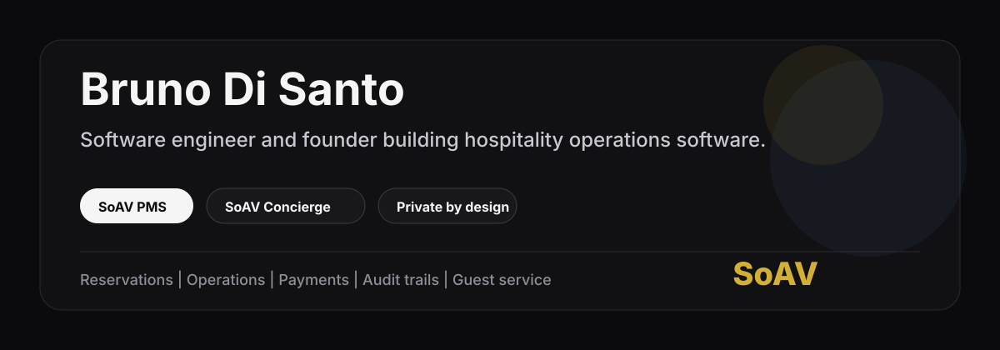

# Bruno Di Santo

**Software engineer and founder building SoAV PMS and SoAV Concierge.**

Hospitality software for boutique teams: reservations, front desk workflows,
guest operations, payments, audit trails, and concierge execution.

[LinkedIn](https://www.linkedin.com/in/disantobruno/) | [GitHub](https://github.com/bzbhh)

---

## Building

I am building **SoAV**, focused on two hospitality products:

| Product | Focus |
| --- | --- |
| **SoAV PMS** | A hotel operating system for reservations, rooms, operations, payments, team workflows, and auditability. |
| **SoAV Concierge** | A concierge operations layer for guest requests, service coordination, and high-touch hospitality teams. |

The production code is private. That is intentional. I do not publish customer
data, credentials, internal business logic, or operational attack surface just to
make a GitHub profile look busier.

What I do share publicly is selected, sanitized proof of work: architecture
notes, case studies, product thinking, and small technical artifacts that can be
shown safely.

---

## Engineering Focus

- **Frontend product engineering**: React, TypeScript, operational UX, dense dashboard interfaces.
- **Backend and data contracts**: Supabase, PostgreSQL, RLS, RPC boundaries, audit logs, typed service layers.
- **Security posture**: fail-closed auth, environment isolation, least privilege, private-by-default product code.
- **Payments and operations**: Stripe flows, folios, reservation ledgers, guest-facing and staff-facing workflows.
- **Quality discipline**: Vitest, Playwright, source-of-truth tests, regression coverage, real staging checks.

I care about software that survives real operations, not just clean screenshots.

---

## How I Work

I build from the product contract first:

1. What should the user be able to do?
2. What data must be true after the action?
3. What can fail, and how should it fail safely?
4. What belongs in the UI, the service layer, the database, and the audit log?
5. What evidence proves it works on the real path?

For SoAV, that means prioritizing real authentication, real persistence, real
hotel workflows, and a system that can be trusted by the people running the
property.

---

## Current Public Surface

Most active product repositories are private while the company is being built.
This profile will only show public repositories when they are safe and useful:

- sanitized SoAV product case studies
- architecture notes without secrets or production code
- security and testing writeups
- small standalone examples when they do not expose the private product

No fake open-source activity. No leaked product internals. No demo code pretending
to be the real system.

---

## Contact

The best way to reach me is through LinkedIn:

**[linkedin.com/in/disantobruno](https://www.linkedin.com/in/disantobruno/)**
