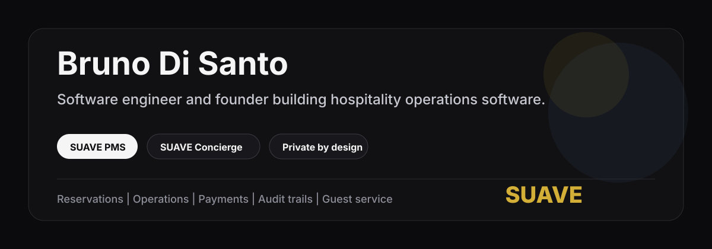

# Bruno Di Santo

**Founder and engineer building SUAVE: hospitality software for boutique hotels.**

Mexico City and Oaxaca. Currently in private beta with a boutique hotel on the
Oaxaca coast.

[LinkedIn](https://www.linkedin.com/in/disantobruno/)

---

## Building

| Product | What it is |
| --- | --- |
| **SUAVE PMS** | A hotel operating system for reservations, rooms, payments, folios, team workflows, and full auditability. |
| **SUAVE Concierge** | A staff platform for guest requests including transport, dining, spa, and excursions, with coordination and audit trail across the on-property team. |

Production code is private. I don't publish customer data, credentials, or
internal architecture to make a profile look busier.

---

## Engineering Focus

- **Frontend product:** React, TypeScript, dense operational UIs, dashboards for staff who work the system all day.
- **Backend and data:** Postgres with row-level security, RPC boundaries, durable audit logs, typed service layers.
- **Security posture:** fail-closed auth, least privilege, environment isolation, private-by-default.
- **Payments and operations:** Stripe, folios, reservation ledgers, guest-facing and staff-facing flows.
- **Quality discipline:** Vitest, Playwright, single-source-of-truth tests, staging gates against the real backend.

Software that survives real hotel operations, not demo screenshots.

---

## How I Work

1. What should the user be able to do?
2. What data must be true after the action?
3. What can fail, and how should it fail safely?
4. What belongs in the UI, the service layer, the database, and the audit log?
5. What evidence proves it works on the real path?

---

## Contact

**[linkedin.com/in/disantobruno](https://www.linkedin.com/in/disantobruno/)**
