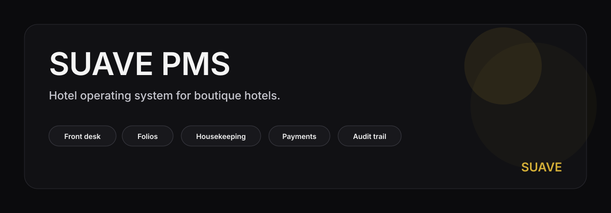

# SUAVE PMS

**Hotel operating system for boutique hotels.**

A desktop-first property management system for properties in the 8 to 25 room range —
reservations, front desk, housekeeping, folios, payments, rates, and reports —
built to be operated all day by the front-desk team.

[← Back to profile](../README.md) &nbsp;·&nbsp; [LinkedIn](https://www.linkedin.com/in/disantobruno/)

---

## What it does

- **Reservations** — multi-channel bookings, daily arrival and departure boards, room change, no-show, cancellation.
- **Front desk** — one-click check-in and checkout, in-house roster, late checkout, early check-in.
- **Housekeeping** — kanban synced with reservation state, mobile-friendly cleaning interface, status flow.
- **Maintenance** — ticket tracking, assignment, comments, history.
- **Folios** — charges, payments, discounts, voids, refunds, full reservation ledger.
- **Payments** — Stripe integration end to end, with transaction audit.
- **Rates** — per-room calendar, seasonal pricing, configurable fees.
- **Reports and night audit** — daily reports, revenue, occupancy, configurable periods.
- **Settings** — hotel configuration, team and role management, integrations, notifications.
- **Bilingual ES / EN, light and dark modes.**

## Who it's for

Independent boutique hotels in the 8 to 25 room range. The kind of property
where Opera Light is too heavy, Cloudbeds is too generic, and a spreadsheet
is one missed update away from a double-booking.

## How it's built

- **Frontend** — React, TypeScript, dense operational UI, keyboard-first, desktop-first layout.
- **Backend** — Postgres with row-level security, per-hotel isolation, RPC boundaries, full audit log on every mutation.
- **Auth** — fail-closed authentication, role-based access for manager, receptionist, housekeeping, and maintenance.
- **Quality** — strict typecheck, unit and integration tests, end-to-end browser tests, gated CI against the real backend.

## What makes it different

- **Audit-first.** Every action that changes data is recorded — who, when, what. Built into the service layer, not bolted on.
- **Fail-closed by design.** When a critical dependency is unavailable, the system refuses the operation rather than silently degrading or guessing.
- **Desktop-first, not desktop-also.** Built for staff who use the product eight hours a day, not for guests browsing on a phone.
- **Boutique-native.** The data model, the role matrix, and the workflows are sized for 8 to 25 rooms — not a stripped-down enterprise PMS.

---

**Contact:** [linkedin.com/in/disantobruno](https://www.linkedin.com/in/disantobruno/)

